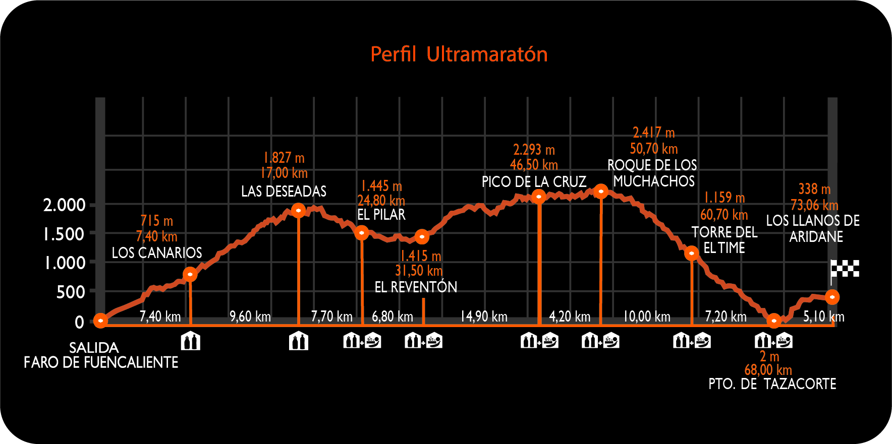

## **Análisis Exploratorio de Datos de la Ultra Maratón Transvulcania 🌋**

La Transvulcania no es solo una carrera; es la heredera de antiguos senderos de trashumancia que históricamente articularon la comunicación entre las remotas comunidades de la isla.

Lo que antaño fue una red de caminos para el ganado, hoy se ha transformado en un desafiante recorrido de 73 kilómetros que serpentea entre imponentes volcanes, frondosos bosques y las características playas de arena negra de La Palma, otorgándole una personalidad única y marcada en el panorama del trail running.

Con este Análisis Exploratorio de Datos se pretende comprender en profundidad las dinámicas y características de la carrera Transvulcania a través del análisis de los datos históricos de participación y rendimiento de sus atletas.

El principal objetivo del estudio será identificar tendencias relevantes, patrones en la participación por género, nacionalidad y club, la evolución del rendimiento a lo largo de los años, y la relación entre diferentes variables como edad y velocidad.

Para llevar a cabo este análisis, se han utilizado diversas librerías de **Python** especializadas en manipulación y visualización de datos, como **Pandas**, **Seaborn**, **NumPy** y **Matplotlib**.

El dataset utilizado para este análisis puede encontrarse en [este enlace](https://www.kaggle.com/datasets/aiaiaidavid/the-big-dataset-of-ultra-marathon-running).

Puedes consultar los gráficos generados en [este notebook](eda_ultra_marathon.ipynb) o acceder directamente al informe ejecutivo [aquí](assets/informe_ejecutivo.pdf)
